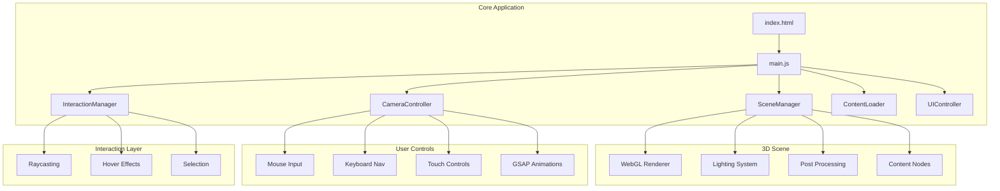

# 3D Spatial Navigation Website Platform

## Architecture Overview




## Technology Stack

- **3D Engine**: Three.js r161+ with WebGL 2 (WebGPU-ready architecture)
- **Animation**: GSAP for smooth camera transitions and object animations
- **Build**: Native ES modules (no bundler required for development)
- **Styling**: Modern CSS with custom properties, 3D transforms, View Transitions API

## File Structure

```
/artasas
├── index.html                    # Main entry with semantic structure
├── assets/
│   ├── css/
│   │   ├── reset.css            # Modern CSS reset
│   │   ├── variables.css        # CSS custom properties (colors, 3D params)
│   │   ├── ui-overlay.css       # 2D UI overlay styles
│   │   └── loading.css          # Loading screen styles
│   ├── js/
│   │   ├── main.js              # Application entry point
│   │   ├── modules/
│   │   │   ├── SceneManager.js      # Three.js scene, renderer, lighting
│   │   │   ├── CameraController.js  # Orbital camera with GSAP transitions
│   │   │   ├── InteractionManager.js # Raycasting and selection
│   │   │   ├── ContentLoader.js     # Asset loading with progress
│   │   │   ├── UIController.js      # 2D UI overlay management
│   │   │   └── ContentNodes.js      # 3D content node generation
│   │   └── utils/
│   │       ├── AnimationHelpers.js  # GSAP utilities, easing
│   │       ├── WebGLDetector.js     # Feature detection
│   │       └── AccessibilityManager.js # A11y announcements
│   ├── shaders/
│   │   ├── glow.vert            # Glow effect vertex shader
│   │   └── glow.frag            # Glow effect fragment shader
│   └── textures/
│       └── (environment maps, sprites)
└── fallback/
    └── index.html               # 2D fallback for non-WebGL browsers
```

## Key Implementation Details

### 1. Scene Setup (SceneManager.js)

- Initialize Three.js with antialiasing, alpha, and logarithmic depth buffer
- Create star field background with particle system (10,000+ particles)
- Set up cyberpunk lighting: ambient (low), point lights (neon colors), spotlights for focal points
- Post-processing pipeline: UnrealBloomPass, ChromaticAberration, FilmGrain
- Handle resize with proper aspect ratio and pixel density

### 2. Orbital Navigation (CameraController.js)

```javascript
// Camera positions for each content node
const nodePositions = [
  { position: new Vector3(0, 0, 50), target: new Vector3(0, 0, 0) },  // Overview
  { position: new Vector3(20, 5, 15), target: new Vector3(25, 0, 10) }, // Node 1
  // ... more nodes
];

// GSAP-powered smooth transitions
function navigateToNode(index) {
  gsap.to(camera.position, {
    x: nodePositions[index].position.x,
    y: nodePositions[index].position.y,
    z: nodePositions[index].position.z,
    duration: 2,
    ease: "power2.inOut"
  });
}
```

- Support mouse drag for free orbit rotation
- Scroll wheel for zoom (clamped min/max)
- Click on nodes to auto-navigate
- Keyboard: Arrow keys for rotation, +/- for zoom, number keys for direct node access

### 3. Content Nodes (ContentNodes.js)

Each content section is a 3D "planet" with:

- Glowing emissive core (IcosahedronGeometry or custom)
- Orbiting ring/particles
- Floating text labels (CSS2DRenderer for crisp text)
- Hover state: scale up, intensify glow
- Active state: expanded detail panel

Content structure:

1. **Central Hub** - Welcome/brand identity
2. **About Node** - Introduction content
3. **Work/Projects Node** - Portfolio items as orbiting sub-nodes
4. **Services Node** - Feature highlights
5. **Contact Node** - Contact form as floating panel

### 4. Interaction System (InteractionManager.js)

- Raycaster updated every frame on mouse move
- Hover detection with debounce (16ms)
- Click triggers navigation or content panel
- Touch: tap for select, pinch for zoom, swipe for rotate
- Focus management for keyboard navigation (Tab cycles through nodes)

### 5. UI Overlay (UIController.js)

- Navigation menu (fixed position, glassmorphism style)
- Mini-map showing node positions and current location
- Loading progress with percentage and "Skip" button
- Content panels that slide in from right (View Transitions API)
- Accessibility: Skip links, ARIA live regions, reduced motion toggle

### 6. Accessibility Features

- **WebGL fallback**: Detect and serve 2D site if WebGL unavailable
- **Reduced motion**: `prefers-reduced-motion` disables camera animations, uses instant transitions
- **Keyboard navigation**: Full Tab/Enter/Arrow key support
- **Screen reader**: ARIA live regions announce current location, available actions
- **High contrast**: CSS custom properties allow theme switching

### 7. Performance Optimizations

- **LOD**: Nodes simplify geometry at distance
- **Frustum culling**: Built-in with Three.js, verify objects use it
- **Instance rendering**: For particle systems and repeated geometry
- **Delta time**: Frame-independent animations
- **Adaptive quality**: Detect GPU capability, adjust post-processing

```javascript
// Performance tier detection
const tier = detectGPUTier();
if (tier.tier < 2) {
  renderer.setPixelRatio(1);
  disableBloom();
  reduceParticles();
}
```

### 8. Progressive Loading

1. **Instant**: HTML skeleton + CSS loading animation (0ms)
2. **Critical** (target < 2s): Three.js core, basic scene, low-poly nodes
3. **Enhanced** (lazy): High-res textures, full post-processing, audio

## Visual Design Specifications

### Color Palette (CSS Variables)

```css
:root {
  --bg-primary: #0a0a0f;
  --neon-cyan: #00f5ff;
  --neon-magenta: #ff00ff;
  --neon-purple: #8b5cf6;
  --text-primary: #e0e0e0;
  --glass-bg: rgba(10, 10, 15, 0.7);
  --glow-intensity: 1.5;
}
```

### Lighting Setup

- Ambient: `#1a1a2e` at intensity 0.2
- Point light 1: `#00f5ff` (cyan) - positioned near About node
- Point light 2: `#ff00ff` (magenta) - positioned near Work node
- Spot light: `#ffffff` - highlights active/hovered node

## Browser Support


| Browser        | Minimum Version | Notes                             |
| -------------- | --------------- | --------------------------------- |
| Chrome/Edge    | 100+            | Full support, WebGPU beta         |
| Firefox        | 100+            | Full WebGL 2                      |
| Safari         | 15+             | WebGL 2, some post-fx limitations |
| iOS Safari     | 15+             | Touch optimized                   |
| Android Chrome | 100+            | Performance tier detection        |


## Deliverables Summary

1. Complete 3D navigation platform with 5 content nodes
2. Smooth orbital camera with GSAP transitions
3. Interactive content nodes with hover/click states
4. 2D UI overlay with navigation and mini-map
5. Full accessibility support (keyboard, screen reader, reduced motion)
6. 2D fallback for non-WebGL browsers
7. Performance optimization with adaptive quality
8. Modern cyberpunk visual design with bloom effects

